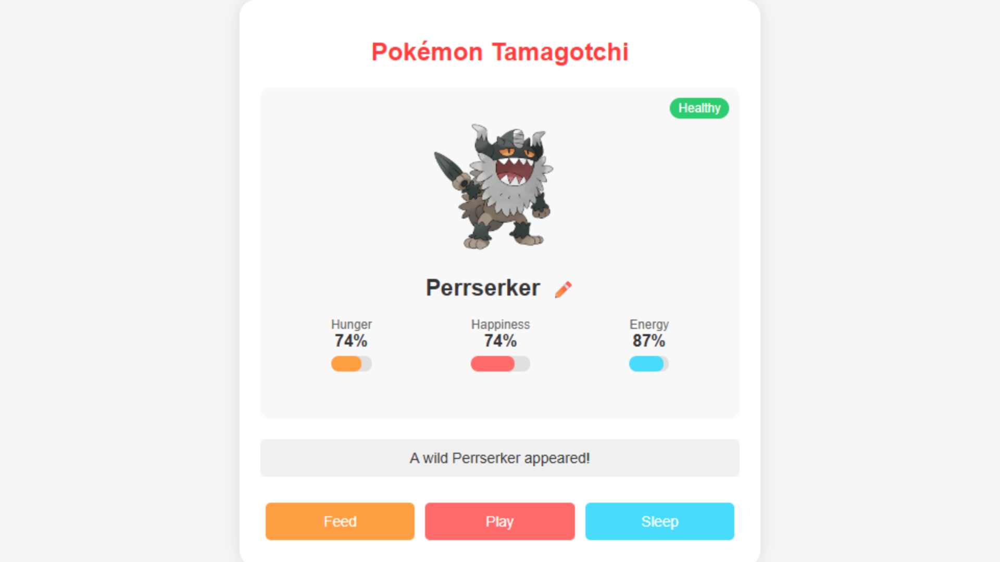

# Pokégotchi

A virtual pet game featuring Pokémon with persistent game state and nickname functionality.

## Features

- 🐾 **Adopt random Pokémon** from all generations (1-8)
- 🏷️ **Name your Pokémon** with custom nicknames
- 🍎 **Feed** to maintain hunger levels
- 🎾 **Play** to keep your Pokémon happy
- 💤 **Sleep** to restore energy
- 📱 **Mobile-friendly** responsive design
- 🔔 **Browser notifications** when stats are low
- 💾 **Auto-save progress** between sessions
- ⏳ **24-hour persistence** (resets after a day)

## How to Play

1. **Get a Pokémon**: Start with a random Pokémon
2. **Care for it**:
   - Feed when hungry (hunger stat)
   - Play to keep it happy (happiness stat)
   - Put to sleep to restore energy
3. **Monitor status**: Check the colored status indicator
4. **Nickname**: Click the ✏️ icon to give your Pokémon a name

## Technical Details

- **Built with**: HTML5, CSS3, JavaScript
- **API**: [PokéAPI](https://pokeapi.co/)
- **Storage**: localStorage for game persistence
- **Notifications**: Web Notifications API

## Installation

No installation required! Just open `index.html` in any modern browser.

For Android app conversion:
1. Wrap in a WebView
2. Add Android notification support
3. Consider using native storage instead of localStorage

## License

MIT License - See [LICENSE](LICENSE) for details.